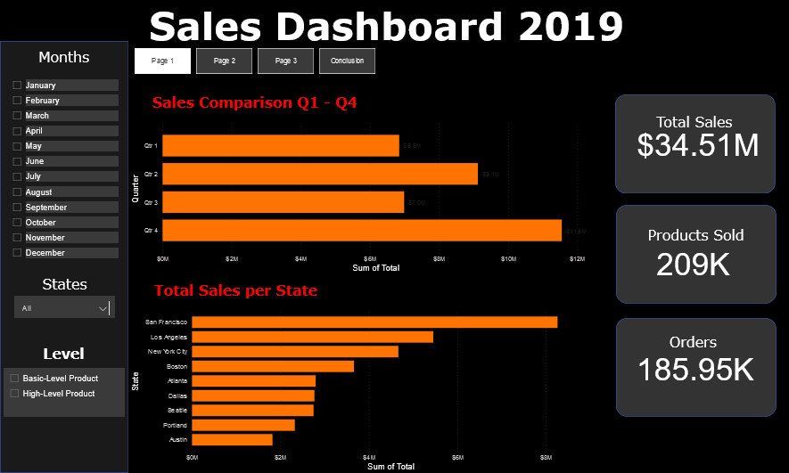
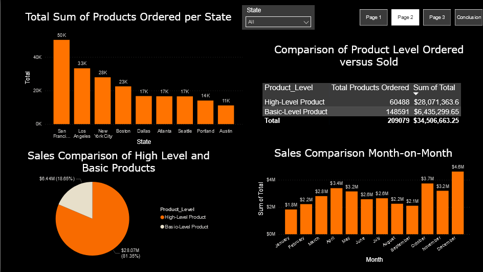

# Store Sales-Dashboard

The client is an electornic company that has store in multiple US states. The records are across the year 2019 and we are trying to interpret the data and see how the company performed

I used Python to clean the data and Power Bi for visualization for this project.

# Column Names and Description:

1. Order_ID: ID's for all the orders
2. Product: Products Sold
3. Quantity_Ordered: How many pieces were sold
4. Price_Each: Cost for the product
5. Order_Date: Date a purchase was made
6. Purchase_Address: Address of the purchaser

# Questions

1. How much money did we make this year?
2. Can we identify any seasonality in the sales?
3. What are our best and worst-selling products?
4. How do sales compare to previous months or weeks?
5. Which cities are our products delivered to most?
6. How do product categories compare in revenue generated and quantities ordered?

# Data Cleaning

Evaluated the data sheets and all the column names were the same across the whole year the only difference was in September and February where the date didn't have time and we changed that so that the entire dataset could be same.

We added an additional column for the Product type to distinguish between products which are Basic and High Level.

Once the data from all the months was perfect we combined them into on sheet and exported it and that is what was upload onto Power Bi for Visulization

# Dashboard

# Conclusion
1. The second and fourth quarter are the busiest and that is the period the company makes the most sales. The fourth quarter has the highest sales it being holiday season hence best time to target promotions.  
2. San Francisco, Los Angeles and New York City are they key states that bring in most sales compare to the other states.
3. AAA Battery is the fastest selling product across all the stores in terms of volume.
4. February and September are the only two months when the sells of the Basic-Level products were considerably higher than the High-Level Products

View my [Dashboard Live](https://app.powerbi.com/groups/me/reports/cb6be3af-8c77-4f7f-9be2-d059c4834949/ReportSection?experience=power-bi)
